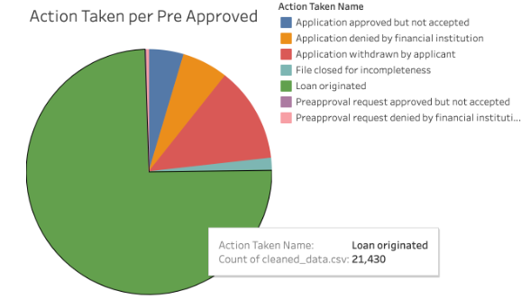

# Evaluating Home Mortgage Eligibility Criteria using Random Forest Classification Models 

The Home Mortgage Disclosure Act was passed in 1975 to protect homeowners by mandating that financial institutions make home mortgage data publicly available[^1]. The HMDA Loan Application Register was obtained from the federal Consumer Financial Protection Bureau (CFPB), which annually collects, aggregates, and makes publicly available mortgage data as required by the HMDA.

## Overview

In this project, Team 5 will be analyzing the eligibility criteria for home mortgages. The purpose of our project is to analyze mortgage data for California for the year 2017. As a team, we will examine multiple indicators such as demographic, personal, and financial information for each mortgage application. For the demographic, we want to identify if there is bias on applicants that come from a more diverse background involving gender, race, and ethnicity. Personal features consists of their location, HOEPA status, or the number of owners in an occupied unit. Lastly, the applicants financial information, which should be the most important, uses data such as their income and loan information. By studying this dataset, the team hopes to further understand loan applications and help others identify what factors can potentially predict the likelyhood of getting an offer. As well, to eliminate lending discrimination in this case if the issues rises. 


### The selected topic and the reasoning for that selection

The reason why we chose to analyze the loan approval process is to identify what are potential factors on these applications. By the year, the reality of wanting to have our dream homes for our families becomes a much more serious topic. Understanding loans and acknowledging what components increases our chances of securing credit at the most favorable terms can save you thousands. Furthermore, we wanted to identify if there was bias on an applicants demographic to ensure that financial institutions are making loan decisions and policies without discrimination. Being that millions of people are applying for mortgages each year, HMDA data 
allows for transparency of what happens to those loan applications.

### The questions that the team plans to answer with the project

* Can Machine Learning Models provide better accuracy in prediciting Loan Origination than the current Preapproval process?
* Is there a gender/race/ethnicity bias present in the data?
* Does the applicants county/address have an affect on loan origination? 
* Which financial/applicant/demographic features have the greatest impact on Loan Origination?

### A description of the Repository 

This repository is structured as follows:

```
├── main
│   ├── README.md
│   ├── ETL.ipynb
│   ├── ml_analysis.ipynb
│   ├── data/
│   │   ├── README.md
│   ├── sql/
│   │   ├── schema.sql
│   │   ├── query.sql
|   ├── data_dictionaries/
│   │   ├── README.md
│   │   ├── raw_data_column_typeformat.pdf
│   │   ├── raw_data_dictionary
│   │   ├── raw_data_types
│   ├── EDA/
│   |   ├── name_number_table.csv
│   │   ├── columnar_data.csv
│   |   ├── exploratory_data_analysis.ipynb
│   │   ├── data_cleaning.ipynb
│   │   ├── name_num_split.ipynb
│   │   ├── splitting_data.ipynb
│   ├── ML/
│   |   ├── brfc_0.txt
│   |   ├── brfc_1.txt
```

### Technologies Used

The technologies used in this project include:

* Google Colab/Jupyter Notebook
* Amazon Web Services: Simple Storage Solution (AWS S3)
* Amazon Web Services: Relational Database Service (AWS RDS)
* PostgreSQL/pgAdmin 
* Python
* PySpark 
* Pandas
* PsycopG2
* skLearn
* imbLearn
* Matplotlib
* Tableau
* Google Slides 

## Exploratory Data Analysis

 The most recent release of HMDA Data for California saw a dataset containing over 1.7 million records of home mortgage applicants in 2017. The data portrays an applicant's financial, personal, and demographic information through various categorical and numeric variables.

### A description of the data

The original CSV file contained 1,714,459 rows of string, integer and float data spread over 78 columns. Columns can be categorized as: 

```python


#demographic float columns, 
demographics_columns = ['population', 
    'minority_population', 
    'hud_median_family_income', 
    'tract_to_msamd_income', 
    'number_of_owner_occupied_units', 
    'number_of_1_to_4_family_units']

# categorical text/numeric
applicant_sex_columns = ['applicant_sex', 
    'applicant_sex_name', 
    'co_applicant_sex', 
    'co_applicant_sex_name']

race_ethnicity_columns = ['applicant_ethnicity_name', 
    'applicant_ethnicity', 
    'co_applicant_ethnicity_name', 
    'co_applicant_ethnicity', 
    'applicant_race_1', 
    'applicant_race_2', 
    'applicant_race_3', 
    'applicant_race_4', 
    'applicant_race_5', 
    'co_applicant_race_1', 
    'co_applicant_race_2', 
    'co_applicant_race_3', 
    'co_applicant_race_4', 
    'co_applicant_race_5', 
    'applicant_race_name_1', 
    'applicant_race_name_2', 
    'applicant_race_name_3', 
    'applicant_race_name_4', 
    'applicant_race_name_5', 
    'co_applicant_race_name_1', 
    'co_applicant_race_name_2', 
    'co_applicant_race_name_3', 
    'co_applicant_race_name_4', 
    'co_applicant_race_name_5']

# loan info float
monetary_columns = ['loan_amount_000s', 
    'applicant_income_000s',
    'rate_spread']

# loan info categorical
loan_info_columns = ['loan_type_name', 
    'loan_type', 
    'property_type_name', 
    'property_type', 
    'loan_purpose_name', 
    'loan_purpose', 
    'owner_occupancy_name', 
    'owner_occupancy']

# preapproval/approval columns
preapproval_columns = ['preapproval_name', 
    'preapproval']
approval_columns = ['action_taken_name', 
    'action_taken']

# denial/result columns
denial_reason_columns = ['denial_reason_1', 
    'denial_reason_2', 
    'denial_reason_3', 
    'denial_reason_name_1',
    'denial_reason_name_2',
    'denial_reason_name_3']

loan_result_columns = ['purchaser_type_name', 
    'purchaser_type',
    'hoepa_status_name', 
    'hoepa_status', 
    'lien_status_name',
    'lien_status']

# date/time/location columns
date_time_loc_columns = ['as_of_year',  
    'agency_name', 
    'agency_abbr', 
    'agency_code',
    'msamd_name', 
    'msamd', 
    'state_name', 
    'state_abbr', 
    'state_code', 
    'county_name', 
    'county_code', 
    'census_tract_number', 
    'application_date_indicator']

# misc columns
tracking_columns = ['edit_status_name', 
    'edit_status', 
    'sequence_number',
    'respondent_id']

```

Columns containing categorical information like 'loan_purpose' have a corresponding "name" column (i.e., 'loan_type_name'), which correlates a numerical label to each cateogorical variable. (i.e., loan_type = 1, loan_type_name = 'Conventional') The following columns follow this scheme are as follows:

``` python
categorical_columns = {'loan_type_name': 'loan_type',
 'property_type_name': 'property_type',
 'loan_purpose_name': 'loan_purpose',
 'owner_occupancy_name': 'owner_occupancy',
 'purchaser_type_name': 'purchaser_type',
 'hoepa_status_name': 'hoepa_status',
 'applicant_ethnicity_name': 'applicant_ethnicity',
 'co_applicant_ethnicity_name': 'co_applicant_ethnicity',
 'applicant_sex_name': 'applicant_sex',
 'co_applicant_sex_name': 'co_applicant_sex',
 'applicant_race_name_1': 'applicant_race_1',
 'co_applicant_race_name_1': 'co_applicant_race_1'
 'applicant_race_name_2': 'applicant_race_2',
 'co_applicant_race_name_2': 'co_applicant_race_2'
 'applicant_race_name_3': 'applicant_race_3',
 'co_applicant_race_name_3': 'co_applicant_race_3'
 'applicant_race_name_4': 'applicant_race_4',
 'co_applicant_race_name_4': 'co_applicant_race_4'
 'applicant_race_name_5': 'applicant_race_5',
 'co_applicant_race_name_5': 'co_applicant_race_5',
 'purchaser_type_name': 'purchaser_type',
 'hoepa_status_name': 'hoepa_status', 
 'lien_status_name': 'lien_status',
 'denial_reason_name_1':'denial_reason_1',
 'denial_reason_name_2':'denial_reason_2',
 'denial_reason_name_3':'denial_reason_3',
 'county_name':'county_code',
 'state_name':'state_code',
 'agency_name':'agency_code',
 'edit_status_name':'edit_status',
 'preapproval_name':'preapproval',
 'action_taken_name':'action_taken'}
```

The CSV file "/EDA/name_number_table.csv" aggregates all categorical entries and their corresponding numeric label. 


## Extract, Transform, Load 

After downloading the compressed datafile from the CFPB, the raw dataset was extracted and uploaded to an S3 bucket for use in the project. Using Google Colab, a Jupyter Notebook was created with a PySpark session connecting to the S3 bucket along with a JDBC driver to connect to the RDS.

### Data Cleaning

Once loaded into a PySpark dataframe, the raw dataset was checked for null and duplicate values. While the majority of columns contained complete information, 29 columns were identified as having high-null value counts (1 million +) and were dropped from the dataset. These columns include: 

```Python

drop_df = df.drop(
    'as_of_year',
    'respondent_id',
    'edit_status',
    'edit_status_name',
    'sequence_number',
    'application_date_indicator',
    'applicant_race_2',
    'applicant_race_3',
    'applicant_race_4',
    'applicant_race_5',
    'applicant_race_name_2',
    'applicant_race_name_3',
    'applicant_race_name_4',
    'applicant_race_name_5',
    'co_applicant_race_2',
    'co_applicant_race_3',
    'co_applicant_race_4',
    'co_applicant_race_5',
    'co_applicant_race_name_2',
    'co_applicant_race_name_3',
    'co_applicant_race_name_4',
    'co_applicant_race_name_5',
    'denial_reason_1',
    'denial_reason_2',
    'denial_reason_3',
    'denial_reason_name_1',
    'denial_reason_name_2',
    'denial_reason_name_3',
    'rate_spread')

```

After dropping these columns, the dataset was checked again for null and duplicate values, which were removed. 

The cleaned dataset was now composed of 1,466,293 rows of data spread over 49 columns.  

### Data Pipeline

The cleaned dataset was split in two: one dataframe containing both categorical and continuous numerical data, and a second containing the corresponding, text-based categorical values for each mortgage application. 

After connecting to the AWS RDS using pgAdmin, a new database was created using the schema, below:

``` SQL

DROP TABLE IF EXISTS text_data;
DROP TABLE IF EXISTS numeric_data;


CREATE TABLE text_data(
agency_name VARCHAR,
agency_abbr VARCHAR,
[...]
application_id BIGINT,
PRIMARY KEY (application_id)
);
 
CREATE TABLE numeric_data(
agency_code INTEGER,
loan_type INTEGER,
[...]
application_id BIGINT,
FOREIGN KEY (application_id) REFERENCES text_data (application_id),
PRIMARY KEY (application_id)
);
```

The cleaned and split datasets were then uploaded to their respective tables using PySpark's JDBC driver.

## Data Analysis 

The Psycopg2 database adapter was used to access the Postgres RDS housing the text and numeric data uploaded in the previous step. See the code[^*] from 'ml_analysis.ipynb.' 

``` Python
def connect(PGEND_POINT, PGDATABASE_NAME, PGUSER_NAME, PGPASSWORD):
    import psycopg2
    # Set up a connection to the postgres server.
    conn_string = "host="+ PGEND_POINT +" port="+ "5432" +" dbname="+ PGDATABASE_NAME +" user=" + PGUSER_NAME +" password="+ PGPASSWORD
    conn = psycopg2.connect(conn_string)
    
    # Create a cursor object
    cursor = conn.cursor()

    print("Connected!")
    return conn, cursor


conn, cursor = connect()

```

## Machine Learning

Once connected to the RDS, an SQL query was passed through the database adapter to pull the appopriate columns for Machine Learning analysis from the database. See the query, below:

``` SQL
SELECT 
    nd.loan_amount_000s,
    nd.applicant_income_000s,
    nd.population,
    nd.minority_population,
    nd.census_tract_number,
    nd.hud_median_family_income,
    nd.tract_to_msamd_income,
    nd.number_of_owner_occupied_units,
    nd.number_of_1_to_4_family_units,
    td.agency_abbr, 
    td.loan_type_name, 
    td.property_type_name, 
    td.loan_purpose_name,
    td.owner_occupancy_name, 
    td.msamd_name,
    td.county_name,
    td.purchaser_type_name,
    td.hoepa_status_name,
    td.lien_status_name,
    td.preapproval_name,
    nd.preapproval,
    td.action_taken_name,
    nd.action_taken
FROM
    numeric_data nd 
INNER JOIN text_data td 
    ON nd.application_id = td.application_id 
ORDER BY nd.loan_amount_000s
```

The result of this query was named "*ml_df*," and used as the base dataset for the Machine Learning analysis.

### Metric Designation

Before venturing into the preprocessing and model design, a metric was extracted from the dataset. In 2017, 27,260 applicants sought preapproval; 20,790 of which were approved for their mortgages. We can extrapolate that the preapproval process has an accuracy score of 76.27% in predicting whether a loan application will be apporoved or not. This accuracy score will be the metric upon which our machine learning models will be measured.

### Preprocessing

The dataset contains categorical text and continuous numerical data which must be preprocessed for the machine learning algorithms. Categorical columns must be encoded using numerical labels using either the LabelEncoder() or OneHotEncoder() modules from the skLearn.preprocessing package. 

The categorical columns must be separated from original dataset by filtering for columns with non-numeric datatypes. See the get_categorical_columns_list() function, which take the dataframe and extracts a list of columns with 'object' datatypes. 

``` Python
def get_categorical_columns_list(data):
    data = data.copy()

    encoded_columns_list = data.dtypes[data.dtypes == 'object'].index.tolist()

    return encoded_columns_list


categorical_columns = get_categorical_columns_list(ml_df)
```

#### Binning & Encoding

Columns with large numbers of unique categories may benefit from binning, a process which combines categories with the lowest frequencies under an "other" label. See the make_bins() function, which takes a dataframe, the desired column, and a numeric cutoff, and returns a new dataframe containing the binned version of the designated column. 

``` Python

def make_bins(data, column, cutoff):
    data.copy()
    #store value counts as label_list
    label_list = data[column].value_counts()
    #make a list of labels with value counts less than the cutoff
    replace_list = list(label_list[label_list < cutoff].index)
    #iterate through replace_list and replace that item with "other" in the dataframe
    for item in replace_list:
        data[column] = data[column].replace(item,'other')
    
    return data


ml_df_binned = make_bins(ml_df, 'county_name', 20000)
ml_df_binned = make_bins(ml_df, 'msamd_name', 20000)

```

The LabelEncoder() module converts categorical values into linearly asscending numerical labels. This keeps the number of input features (columns) constant, but has the potential to impart bias on categories labeled with larger numerical values that previous categories in the series. See the encode_labels() function below, which takes the dataframe and categorical columns, encodes them using the LabelEncoder() method, and returns the encoded dataframe. 

``` Python

def encode_labels(data, categorical_columns):
    from sklearn.preprocessing import LabelEncoder

    data = data.copy()

    categorical_data = data[categorical_columns]

    le = LabelEncoder()

    for column in categorical_data.columns:
        data[column] = le.fit_transform(data[column])

    return data


cat_columns = ['agency_abbr','loan_type_name','loan_purpose_name','property_type_name','owner_occupancy_name','msamd_name','county_name']
ml_df_label_encoded = encode_labels(ml_df_binned, cat_columns)

```

The OneHotEncoder() creates buckets out of the categorical values, creating a new column for every category. While this has the potential to increase the number of input features (columns) significantly, it provides a more accurate reflection of the categorical data contained within. There is no risk of biasing categorical values with higher numerical values since all designated categories will be represent by a value of 1 within their respective columns. The encode_hot_labels() function takes the dataframe and list of categorical columns, uses the OneHotEncoder() method to make buckets from the columns and merges the resulting dataset with the continuous numerical values from the original, returning a new, encoded dataframe. 

``` Python

def encode_hot_labels(data, categorical_columns):
    from sklearn.preprocessing import OneHotEncoder
    data = data.copy()
    # make df of columns to be encoded
    categorical_data = data[categorical_columns]
    #initialize the encoder
    enc = OneHotEncoder(sparse=False)
    #fit and transform the encoded columns
    encoded = enc.fit_transform(categorical_data)
    #create a dataframe of with the encoded data
    encoded_df = pd.DataFrame(encoded)
    #name the columns using the get_feature_names method
    encoded_df.columns = enc.get_feature_names_out(categorical_columns)
    #merge the original and encoded dataframes
    data = data.merge(encoded_df, left_index=True, right_index=True).drop(columns=categorical_columns, axis=1)

    print('encode_data: Done!')
    return data

cat_columns = ['agency_abbr','loan_type_name','loan_purpose_name','property_type_name','owner_occupancy_name','msamd_name','county_name']
ml_df_hot_encoded = encode_hot_labels(ml_df_binned, cat_columns)
```

#### Target Designation, Splitting the Dataset

The *action_taken* column represents the outcome of the loan. In the HMDA dataset from 2017, 809,668 applicants were approved and had their loans originated, receiving an *action_taken* status of 1; 662,643 applicants received an *action_taken* status other than 1, indicating these individuals were not approved for one reason or another. The original eight categories were condensed to two: {0: loan orignated, 1: loan not originated}. This was achieved using the fix_target_column() function, defined below:

``` Python 
def fix_target_data(member):
    if member == 1:
        return 1 
    else:
        return 0


ml_df['action_taken'] = ml_df['action_taken'].apply(fix_target_data)

```

After designating the *target variable*, the model needs to be split into *input features* and a *target column*. The split_target() function takes the dataset and separates it in two: the *target column*, y, and the *input features*, X; see the code below. 


``` Python

def split_target(data, target):
    data = data.copy()
    
    #separate X and y datasets
    y = data[target].ravel()
    X = data.drop(columns=target)

    print('split_target: Done!')
    return X, y


X, y = split_target(ml_df_encoded, target='action_taken')
```

The resulting dataframes must be split into training and testing datasets, using the train_test_split() method from the sklearn.model_selection package, see below:

```Python
from sklearn.model_selection import train_test_split

X_train, X_test, y_train, y_test = train_test_split(X, y, random_state=1, stratify=y)

```

#### Standardization

Given the admixture of small and large numeric values, the machine learning dataset needed to be standardized to prevent distortion of the model toward features with large absolute values. This was achieved by using the skLearn StandardScaler() module, as part of their data preprocessing package. See the code below:

``` Python

def scale_data(train, test):
    from sklearn.preprocessing import StandardScaler
    scaler = StandardScaler()

    #fit the training data 
    t_scaler = scaler.fit(train)
    
    #transform training and test datasets
    train_scaled = t_scaler.transform(train)
    test_scaled = t_scaler.transform(test)

    print('scale_data: Done!')
    return train_scaled, test_scaled


X_train_scaled, X_test_scaled = scale_data(X_train, X_test)

```

### Model Selection & Design

Decision Trees a type of Supervised Machine Learning that can classify a datapoint based on some binary classification scheme. Decision Tree models are relatively impervious to imbalances and are often chosen as the primary machine learning model in loan applications. These models work by deriving a series of conditions from the input features, which are then used to determine a test point's binary outcome[^2]. 

The two decision tree classifiers that will be tested are the Balanced Random Forest Classifier (BRFC) and the Easy Ensemble Classifier (EEC) methods, found in the imblearn.ensemble package. While the BRFC uses a single decision tree model, the EEC classifier uses an ensemble scheme, which incorporates multiple decision trees in one machine learning model. 

#### Balanced Random Forest Classifier

The brfc_model() function takes the split training and testing data, creates a BRFC model, fits the training data, then predicts action_taken for the testing data. This prediction is used to calculate the balanced accuracy score, see below: 

``` Python

def brfc_model(X_train, X_test, y_train, y_test):
    from imblearn.ensemble import BalancedRandomForestClassifier
    model = BalancedRandomForestClassifier()
    model.fit(X_train, y_train)
    y_pred = model.predict(X_test)
    brfc_accuracy = balanced_accuracy_score(y_test, y_pred)
    print('Balanced Accuracy Score: Balanced Random Forest Classifier')
    print(f'Accuracy Score: {brfc_accuracy}')

    return model, y_pred, brfc_accuracy

#Initial Test
brfc_model_0, brfc_0_pred, brfc_0_accuracy = brfc_model(X_train, X_test, y_train, y_test)
#Test 1
brfc_model_1, brfc_1_pred, brfc_1_accuracy = brfc_model(X_train_1, X_test_1, y_train_1, y_test_1)
#Test 2
brfc_model_2, brfc_2_pred, brfc_2_accuracy = brfc_model(X_train_2, X_test_2, y_train_2, y_test_2)

```
One of the benefits of the BRFC is the ability to measure feature importances for each model. The get_feature_importance() function takes model, input_features, file_title, and graph_title, calculates feature importances for each column in the dataset, plots the data onto a horizontal bar graph and returns the feature_importances dataframe, see below:

``` Python
def get_feature_importances(model, input_features, file_title, graph_title, fig_size):
  if not os.path.isdir('./ml'):
    os.makedirs('./ml')
      
  with open(f'./ml/{file_title}_feature_importances.txt','w') as txt_file:
  
    importances = model.feature_importances_
  
    zipped_importances = sorted(zip(importances, input_features.columns), reverse=True)
    importance_df = pd.DataFrame({'importance':[i[0] for i in zipped_importances], 'parameter':[i[1] for i in zipped_importances]})

    importance_df.plot.barh('parameter', y='importance', figsize=fig_size)
    label_ticks = np.arange(len(importance_df['parameter']))
  
    plt.title(f'Feature Importances - {graph_title}')
    plt.yticks(label_ticks)
    plt.xlabel('Input Features')
    plt.ylabel('Importance')
    plt.gca().invert_yaxis()
    plt.savefig(f'./ml/feature_importances_{file_title}.png', bbox_inches='tight')
    plt.show()

    importance_df.to_csv(f'./ml/{file_title}_feature_importances')
    txt_file.write(f'feature importances - {file_title} \n\n')
    txt_file.write(importance_df.to_string())
    print(importance_df.head(20))
    return importance_df

#Initial Test 
brfc_importances = get_feature_importances(model=brfc, input_features = X, file_title='brfc_0', graph_title='BRFC Initial Test', fig_size=(10,20))
[...]
#Test 3
brfc_3_importances = get_feature_importances(model=brfc_3, input_features = X_3, file_title='brfc_3', graph_title='BRFC Test 3', fig_size=(10,6))
[...]

``` 

The results of these feature importances were used to determine which columns needed further binning. 

#### Easy Ensemble Classifier 

The eec_model() function takes the split training and testing data, creates a EEC model, fits the training data, then predicts action_taken for the testing data. This prediction is used to calculate the balanced accuracy score, see below: 

``` Python
def get_eec_model(X_train, X_test, y_train, y_test):
    from imblearn.ensemble import EasyEnsembleClassifier 
    #initiate eec model
    model = EasyEnsembleClassifier()
    model.fit(X_train, y_train)
    #predict target values for test data
    y_pred = eec_model.predict(X_test)
    #calculate accuracy score
    eec_accuracy = balanced_accuracy_score(y_test, y_pred)
    print('Balanced Accuracy Score: Easy Ensemble Classifier')
    print(f'Accuracy Score: {eec_accuracy}')
  
    return model, y_pred, eec_accuracy

#Test 0
eec_model_0, eec_0_pred, eec_0_accuracy = eec_model(X_train, X_test, y_train, y_test)
#Test 1
eec_model_1, eec_1_pred, eec_1_accuracy = eec_model(X_train_1_scaled, X_test_1_scaled, y_train_1, y_test_1)
#Test 2
eec_model_2, eec_2_pred, eec_2_accuracy = eec_model(X_train_2_scaled, X_test_2_scaled, y_train_2, y_test_2)
#Test 3
eec_model_3, eec_3_pred, eec_3_accuracy = eec_model(X_train_3_scaled, X_test_3_scaled, y_train_3, y_test_3)
```

## Results

Both models and their respective tests were measured using:
* Balanced Accuracy Score (from sklearn.metrics)
* Confusion Matrix  (from sklearn.metrics)
* Imbalanced Classification Report


``` Python
def model_metrics(model_name, test, pred, file_title):
    if not os.path.isdir('./ml'):
        os.makedirs('./ml')
        
    with open(f'./ml/{file_title}_results.txt','w') as txt_file:
        model_accuracy = balanced_accuracy_score(test, pred)
        cm = confusion_matrix(test, pred)
        cm_df = pd.DataFrame(cm, columns=['Predicted 0','Predicted 1'], index=['Actual 0','Actual 1'])
        crib = classification_report_imbalanced(test,pred)
        txt_file.write(f'Accuracy Score: {model_accuracy} \n\n')
        txt_file.write(str(cm_df))
        txt_file.write(f'\n\n {crib}')
        print(model_name)
        print(f'Accuracy Score: {model_accuracy:.4f}')
        print(cm_df)
        print(crib)

model_metrics(mode_name='Balanced Random Forest Classifier - Initial Test', test=y_test, pred=brfc_y_pred, file_title='brfc_0')
model_metrics(mode_name='Balanced Random Forest Classifier - Test 1', test=y_test_1, pred=brfc_1_pred, file_title='brfc_1')

```
### Balanced Random Forest Classifier 

The results of the initial BRFC test using the OneHotEncoded() dataset are as follows: 
Balanced Accuracy Score: 0.5352
Confusion Matrix: Balanced Random Forest Classifier Initial Test

|         | Predicted 0 | Predicted 1|
|---------|-------------|------------|
|Actual 0 |       88891 |       75147|
|Actual 1 |       94885 |      106389|

Imbalanced Classification Report: Balanced Random Forest Classifier Initial Test 

|              |      pre  |     rec   |    spe   |     f1   |    geo   |    iba  |     sup|
|--------------|-----------|-----------|----------|----------|----------|---------|--------|
|          0   |    0.48   |   0.54    |  0.53    |  0.51    |  0.54    |  0.29   | 164038|
|          1   |    0.59   |   0.53    |  0.54    |  0.56    |  0.54    |  0.29   | 201274|
|avg / total   |    0.54   |   0.53    |  0.54    |  0.54    |  0.54    |  0.29   | 365312|

#### BRFC Test 1

The results of BRFC Test 1 with the reduced, OneHotEncoded dataset are as follows: 
Balanced Accuracy Score: 
Confusion Matrix: Balanced Random Forest Classifier Initial Test

|         | Predicted 0  |Predicted 1|
|---------|--------------|-----------|
|Actual 0 |       88829  |      75209|
|Actual 1 |       94925  |     106349|

Imbalanced Classification Report: Balanced Random Forest Classifier Test 1

|             |       pre  |     rec  |     spe   |     f1   |    geo  |     iba |     sup|
|-------------|------------|----------|-----------|----------|---------|---------|--------|
|          0  |     0.48   |   0.54   |   0.53    |  0.51    |  0.53   |   0.29  |  164038|
|          1  |     0.59   |   0.53   |   0.54    |  0.56    |  0.53   |   0.29  |  201274|
|avg / total  |     0.54   |   0.53   |   0.54    |  0.54    |  0.53   |   0.29  |  365312|


#### BRFC Test 2

Since there was no improvement in accuracy, the BRFC model was run again using the LabelEncoder() method, detailed above. 
The results of BRFC Test 2 are as follows: 
Balanced Accuracy Score: 0.5788
Confusion Matrix: Balanced Random Forest Classifier Initial Test

|         | Predicted 0 | Predicted 1|
|---------|-------------|------------|
|Actual 0 |       97449 |       67181|
|Actual 1 |       87790 |      114367|

Imbalanced Classification Report: Balanced Random Forest Classifier Test 2 

|            |        pre  |     rec   |    spe  |      f1  |     geo |      iba |      sup|
|------------|-------------|-----------|---------|----------|---------|----------|--------|
|          0 |      0.53   |   0.59    |  0.57   |   0.56   |   0.58  |    0.34  |  164630|
|          1 |      0.63   |   0.57    |  0.59   |   0.60   |   0.58  |    0.33  |  202157|
|avg / total |      0.58   |   0.58    |  0.58   |   0.58   |   0.58  |    0.33  |  366787|

### Easy Ensemble Classifier Results

The results of the initial EEC test are as follows:
Balanced Accuracy Score: 0.5653
Confusion Matrix: Easy Ensemble Classifier Initial Test

||Predicted 0|  Predicted 1|
|---------|-----------|------------|
|Actual 0 |      114574|        69092|
|Actual 1 |       66359|        68194|

Imbalanced Classification Report: Easy Ensemble Classifier Initial Test

|              |      pre  |    rec  |     spe   |     f1  |     geo   |    iba  |     sup|
|--------------|-----------|---------|-----------|---------|-----------|---------|--------|
|          0   |    0.63   |  0.62   |   0.51    |  0.63   |   0.56    |  0.32   | 183666|
|          1   |    0.50   |  0.51   |   0.62    |  0.50   |   0.56    |  0.31   | 134553|
|avg / total   |    0.58   |  0.57   |   0.56    |  0.57   |   0.56    |  0.32   | 318219|

#### Test 1

The dataset was binned to reduce the number of counties/MSAMDs. The results of this test are as follows:
Balanced Accuracy Score: 0.5648
Confusion Matrix: Easy Ensemble Classifier Test 1: Reduced Counties/MSAMDs

|         | Predicted 0 | Predicted 1|
|---------|-------------|------------|
|Actual 0 |      114583 |       69083|
|Actual 1 |       66507 |       68046|

Imbalanced Classification Report: Easy Ensemble Classifier Test 1

|             |       pre   |    rec    |   spe   |     f1   |    geo   |    iba  |     sup
|-------------|-------------|-----------|---------|----------|----------|---------|---------
|          0  |     0.63    |  0.62     | 0.51    |  0.63    |  0.56    |  0.32   | 183666
|          1  |     0.50    |  0.51     | 0.62    |  0.50    |  0.56    |  0.31   | 134553
|avg / total  |     0.58    |  0.57     | 0.56    |  0.57    |  0.56    |  0.32   | 318219

#### Test 2

The dataset was binned to reduce the number of counties/MSAMDs. The results of this test are as follows:
Balanced Accuracy Score: 0.5912
Confusion Matrix: Easy Ensemble Classifier Test 2: LabelEncoder

|          |Predicted 0 | Predicted 1|
|----------|------------|------------|
|Actual 0  |     123325 |       78671|
|Actual 1  |      70471 |       94107|

Imbalanced Classification Report: Easy Ensemble Classifier Test 2

|               |    pre   |    rec    |   spe    |    f1   |    geo |    iba|       sup|
| -----------|-----------|-----------|-----------|--------|---------|----------|----------|
|          0 |      0.64 |     0.61  |    0.57   |   0.62 |     0.59|      0.35|    201996|
|          1 |      0.54 |     0.57  |    0.61   |   0.56 |     0.59|      0.35|    164578|
|avg / total |      0.60 |     0.59  |    0.59   |   0.59 |     0.59|      0.35|    366574|

## Visualizations


From our bar chat, a vast amount of the upper features are demographic-related features. While this may seem discouraging, it's important to note that the top 2 most significant features are directly linked to the applicant's financials and are much more weighted in the eligibility criteria than the other features.



From our Pre Approval Distribution pie chart, 28,696 people got pre-approved. Out of that pool of pre-approved people we got our second chart that shows that 21,430 people's loans originated, i.e; got approved. So, approximately 75% of the pre-approved pool got approved, which, in a way, indicates that the preapproval reviewers were right 75% of the time. Given the nature of the metric, we decided to use it as a value to validate our machine learning model's accuracy score.


Our interactive map allows users to filter between different demographics and their approvcal percentage based on county. 

## Conclusion
From our analysis, we were able to answer several of the questions we started with. For our machin learning model, we could not provide a better accuracy in predicting loan orginication than the current pre approval proccess as when creating our models we were able to achieve ~59.12% accuracy. We believe the data could have been improved upon by adding credit score/fico score data. For identifying lending descrimination, there may be a disproportionate number of white applicants and male applicants, but it does not necessarily indicate bias since the general population is mostly white and/or male. For an applicants county, there is an effect on approval as county income is significant. Lastly, the most important financial/applicant features were loan amount, applicant income, and tract to MS/AMD income.


## Presentation
https://docs.google.com/presentation/d/1f93N2tBkFzOsnvKHm8yDEEB_12Z-LlqSyPY9UlhBH0Q/edit?usp=sharing

[link to Pie Charts Dashboard](https://public.tableau.com/app/profile/rajeev.thimmareddy/viz/FinalProjectVisualizations_16756661848350/PieChartDashboard)

[link to Bar Char Dashboard](https://public.tableau.com/app/profile/rajeev.thimmareddy/viz/feature-importances/FeatureImportances)

[link to Map Dashboard](https://public.tableau.com/app/profile/nicholas.mckinney/viz/CALoanApproval/Interactive?publish=yes)

## References

[^1]: Consumer Financial Protection Bureau. (2019, March 21). About HMDA. Mortgage Data (HMDA). Retrieved January 25, 2023, from https://www.consumerfinance.gov/data-research/hmda/

[^2]: Consumer Financial Protection Bureau. (n.d.). HMDA Loan Application Register Format - Consumer Financial Protection. HMDA Loan Application Register Format. Retrieved January 26, 2023, from https://files.consumerfinance.gov/hmda-historic-data-dictionaries/lar_record_format.pdf

[^3]: Consumer Financial Protection Bureau. (2019, March 21). HMDA Loan Application Register. Washington, DC.

[^*]: Consumer Financial Protection Bureau (CFPB). (n.d.). Variable List for HMDA Loan Application Register Data. HMDA Loan Application Register Format. Retrieved January 26, 2023, from https://files.consumerfinance.gov/hmda-historic-data-dictionaries/lar_record_format.pdf 

[^*]: Consumer Financial Protection Bureau (CFPB). (n.d.). Code Explanations for Loan Application Register Data. https://files.consumerfinance.gov/hmda-historic-data-dictionaries/lar_record_codes.pdf. Retrieved January 26, 2023, from https://files.consumerfinance.gov/hmda-historic-data-dictionaries/lar_record_codes.pdf 
 
